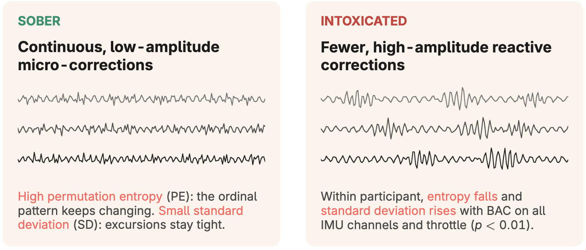
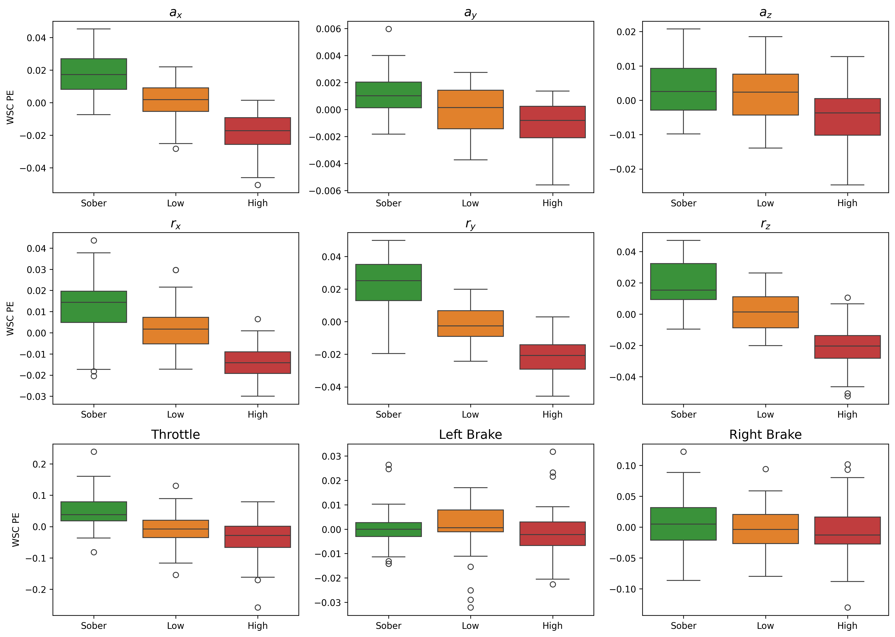
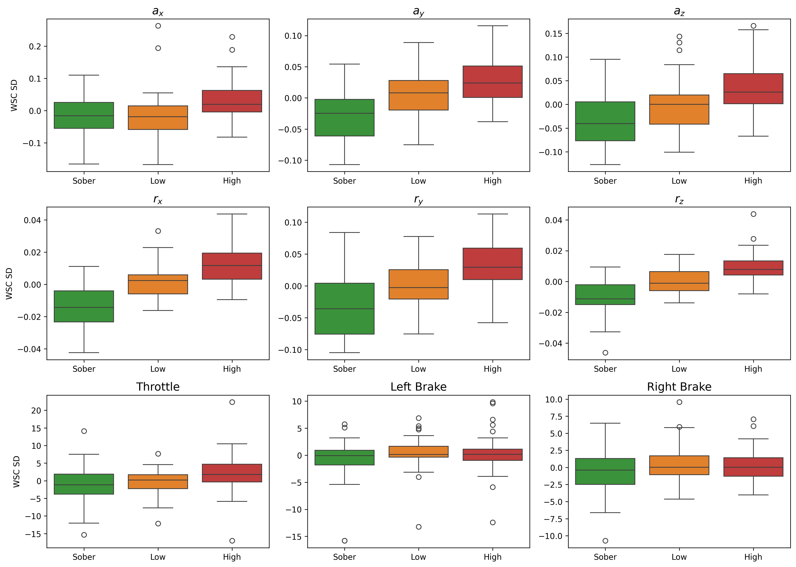
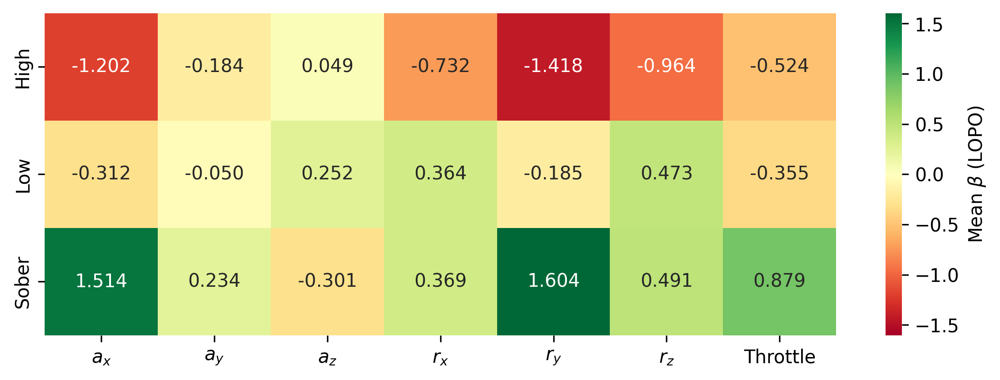

# Impairment detection

<p align="center">
  <a href="https://arxiv.org/abs/2609.38276"></a>
  <a href="LICENSE"></a>
  <a href="LICENSE-CC-BY-4.0.txt"></a>
  
</p>



Code and data to reproduce the results from ["Kinematic Signatures of Impairment: Detecting Alcohol Intoxication in E-Scooter Riders Using Sensor Data and Machine Learning"](https://arxiv.org/abs/2609.38276) (arXiv preprint).

This was a controlled experiment where participants consumed a low and a higher dose of alcohol, then completed a series of tasks on our e-scooter in a controlled setting while we recorded sensor data. To detect alcohol-induced impairment, we compute per-channel permutation entropy on 7 sensor channels (ax, ay, az, rx, ry, rz, throttle), apply within-subject centering (WSC), and evaluate classification of three conditions (Sober, Low, High) using leave-one-participant-out (LOPO) cross-validation (CV).

## Table of contents

- [Impairment detection](#impairment-detection)
  - [Table of contents](#table-of-contents)
  - [Setup](#setup)
  - [Data](#data)
  - [Notebooks](#notebooks)
  - [Repeated-measures rank correlation (entropy)](#repeated-measures-rank-correlation-entropy)
  - [Repeated-measures rank correlation (SD)](#repeated-measures-rank-correlation-sd)
  - [Classification (LOPO CV, 3-class)](#classification-lopo-cv-3-class)
  - [AuROC (LOPO CV)](#auroc-lopo-cv)
  - [LR coefficient heatmap (LOPO CV)](#lr-coefficient-heatmap-lopo-cv)
  - [Paper](#paper)
  - [How to cite](#how-to-cite)
  - [License](#license)

## Setup

The dataset is stored with [Git LFS](https://git-lfs.com/). Install it first, then clone the repository so the `.parquet` file is fetched:

```bash
git lfs install
git clone https://github.com/voiapp/microtox.git
cd microtox
```
> **Note:** If you cloned before installing Git LFS, run `git lfs pull` to download the data.

Run the following commands to create a virtual environment and install dependencies:

```bash
python3.10 -m venv .venv
source .venv/bin/activate
pip install -r requirements.txt
pre-commit install
```
> **Note:** When running notebooks, ensure the kernel is set to use the `.venv` environment.

## Data
- **Location**: `data/`
  - **`data.parquet`**: Time index (ms) and sensor data sampled at 100 Hz for 141 rides from 25 participants — accelerometer (`ax`, `ay`, `az`), gyroscope (`rx`, `ry`, `rz`), `throttle`, `brake_l` and `brake_r`. Each ride has a `ride_id`, `participant_id`, `run` (condition: Sober, Low, High) and `trial` (1 or 2).

## Notebooks
- **Location**: `notebooks/`
  - **`entropy_stats.ipynb`**: Permutation entropy per channel, boxplots by condition and repeated-measures rank correlation with dose.
  - **`sd_stats.ipynb`**: Per-channel standard deviation (SD), boxplots by condition and repeated-measures rank correlation with dose.
  - **`entropy_baseline.ipynb`**: Baseline classifier that sums WSC entropy across channels and thresholds it at the midpoints between condition means (LOPO CV).
  - **`entropy_lr.ipynb`**: Logistic regression on WSC entropy features (LOPO CV), including the coefficient heatmap.
  - **`entropy_svm.ipynb`**: SVM on WSC entropy features (LOPO CV).
  - **`sd_lr.ipynb`**: Logistic regression on SD features (LOPO CV).
  - **`sd_svm.ipynb`**: SVM on SD features (LOPO CV).

## Repeated-measures rank correlation (entropy)

One-sided test (H1: entropy decreases with dose) on rank-transformed values. The repeated-measures correlation accounts for the trials-within-participants nesting via a random intercept per subject. P-values are Holm-Bonferroni corrected across the 9 channels.

| Feature  | p-value  | p < 0.001 |
|----------|----------|-----------|
| ax       | 5.75e-21 | yes       |
| ay       | 6.47e-06 | yes       |
| az       | 8.11e-05 | yes       |
| rx       | 1.01e-16 | yes       |
| ry       | 2.50e-28 | yes       |
| rz       | 1.79e-24 | yes       |
| throttle | 1.92e-08 | yes       |
| brake_l  | 8.89e-02 | no        |
| brake_r  | 8.89e-02 | no        |



## Repeated-measures rank correlation (SD)

One-sided test (H1: SD increases with dose) on rank-transformed values. Same procedure as above.

| Feature  | p-value  | p < 0.01 | p < 0.001 |
|----------|----------|----------|-----------|
| ax       | 8.68e-03 | yes      | no        |
| ay       | 1.98e-08 | yes      | yes       |
| az       | 3.51e-06 | yes      | yes       |
| rx       | 1.07e-14 | yes      | yes       |
| ry       | 1.75e-10 | yes      | yes       |
| rz       | 7.81e-13 | yes      | yes       |
| throttle | 9.07e-03 | yes      | no        |
| brake_l  | 6.51e-02 | no       | no        |
| brake_r  | 6.51e-02 | no       | no        |



## Classification (LOPO CV, 3-class)

| Method            | Accuracy | P High | R High | F1 High | P Low | R Low | F1 Low | P Sober | R Sober | F1 Sober |
|-------------------|----------|--------|--------|---------|-------|-------|--------|---------|---------|----------|
| Sum entropy       | 0.74     | 0.78   | 0.78   | 0.78    | 0.62  | 0.68  | 0.65   | 0.85    | 0.76    | 0.80     |
| Entropy + LR      | 0.85     | 0.87   | 0.89   | 0.88    | 0.81  | 0.76  | 0.78   | 0.87    | 0.91    | 0.89     |
| Entropy + RBF SVM | 0.86     | 0.86   | 0.96   | 0.91    | 0.84  | 0.74  | 0.79   | 0.87    | 0.89    | 0.88     |
| SD + LR           | 0.61     | 0.62   | 0.63   | 0.62    | 0.53  | 0.50  | 0.52   | 0.68    | 0.71    | 0.70     |
| SD + RBF SVM      | 0.60     | 0.60   | 0.61   | 0.60    | 0.49  | 0.58  | 0.53   | 0.77    | 0.60    | 0.68     |

## AuROC (LOPO CV)

| Method            | High vs rest | Low vs rest | Sober vs rest | Weighted OvR | High vs Sober |
|-------------------|--------------|-------------|---------------|--------------|---------------|
| Sum entropy       | 0.9297       | 0.7923      | 0.9475        | 0.8867       | 0.9937        |
| Entropy + LR      | 0.9682       | 0.8912      | 0.9664        | 0.9403       | 0.9995        |
| Entropy + RBF SVM | 0.9625       | 0.9002      | 0.9667        | 0.9417       | 0.9884        |
| SD + LR           | 0.8206       | 0.6936      | 0.8782        | 0.7940       | 0.9024        |
| SD + RBF SVM      | 0.8043       | 0.6844      | 0.8532        | 0.7774       | 0.8618        |

## LR coefficient heatmap (LOPO CV)



| Feature  | Sum mean \|β\| (LOPO) |
|----------|-----------------------|
| ry       | 3.207                 |
| ax       | 3.027                 |
| rz       | 1.928                 |
| throttle | 1.757                 |
| rx       | 1.465                 |
| az       | 0.603                 |
| ay       | 0.469                 |

## Paper

The preprint is available on arXiv: [https://arxiv.org/abs/2609.38276](https://arxiv.org/abs/2609.38276).

## How to cite

If you use this code, data, or ideas in your work, please cite:

```bibtex
@misc{pai2026kinematicsignaturesimpairmentdetecting,
      title={Kinematic signatures of impairment: Detecting alcohol intoxication in e-scooter riders using sensor data and machine learning},
      author={Rahul Rajendra Pai and Marco Dozza and Alexander Rasch and Ali Mohammadi and Marco Capuccini},
      year={2026},
      eprint={2609.38276},
      archivePrefix={arXiv},
      primaryClass={cs.LG},
      url={https://arxiv.org/abs/2609.38276},
}
```

## License
- **Code**: [MIT](LICENSE).
- **Data** (`data/`): [CC BY 4.0](LICENSE-CC-BY-4.0.txt).
